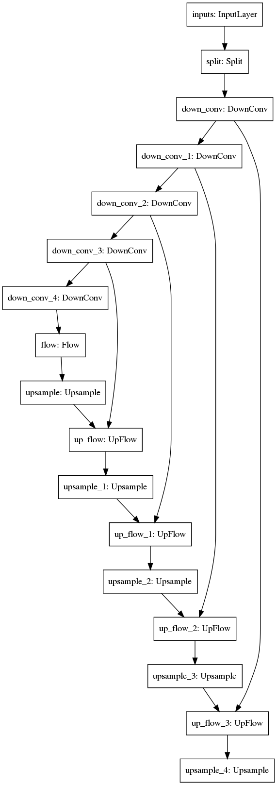
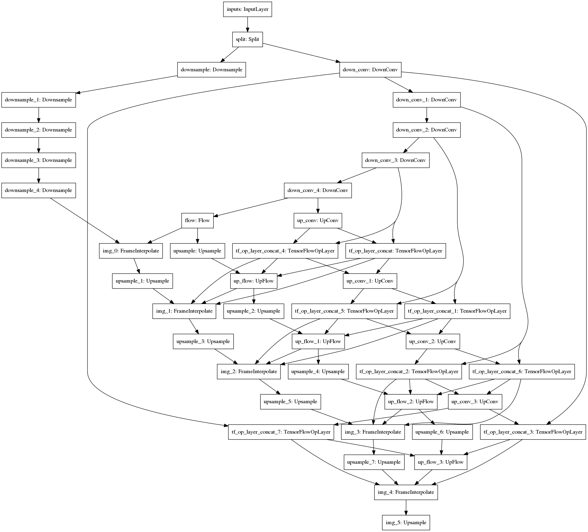
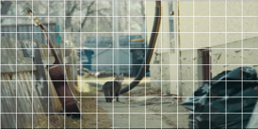
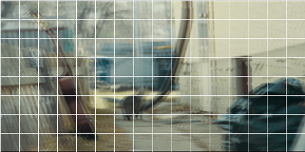

# QPWCNet

This repo contains experimental code for running optical flow and related stuff in Tensorflow 2.

Some efforts have been made to enable quantization through [tensorflow model optimization](https://github.com/tensorflow/model-optimization)
and deploy through [TFLite](https://www.tensorflow.org/lite), though it is still an ongoing development and does not quite work yet.

## Optical Flow

This is the main network, which is intended to predict optical flow from a pair of images.

### Network Architecture



### Sample output

Here's a sample output from a trained model on an excerpt from the [Sintel](http://sintel.is.tue.mpg.de/) dataset.

Previous Frame:


Next Frame:


Ground Truth Flow visualization:


Predicted Flow visualization:


## Pretraining: Frame Interpolation

Inspired by [Temporal Interpolation as an Unsupervised Pretraining Task for Optical Flow Estimation]( https://arxiv.org/abs/1809.08317 ), I tried to run pretraining on the optical flow network
on the [vimeo-triplet](https://toflow.csail.mit.edu) dataset.

### Network Architecture



### Training

```bash
cd qpwcnet/app/
python3 pre_train.py
```

And the log output would be something like the following:

```bash
# ... Boilerplate tensorflow output ...
6414/6414 [==============================] - 7792s 1s/step - loss: 0.0184 - img_0_loss: 0.0044 - img_1_loss: 0.0036 - img_2_loss: 0.0025 - img_3_loss: 0.0017 - img_4_loss: 0.0012 - img_5_loss: 0.0022
Epoch 2/600
6414/6414 [==============================] - 7806s 1s/step - loss: 0.0178 - img_0_loss: 0.0043 - img_1_loss: 0.0035 - img_2_loss: 0.0024 - img_3_loss: 0.0016 - img_4_loss: 0.0012 - img_5_loss: 0.0021   
Epoch 3/600
6414/6414 [==============================] - 7686s 1s/step - loss: 0.0174 - img_0_loss: 0.0043 - img_1_loss: 0.0034 - img_2_loss: 0.0023 - img_3_loss: 0.0016 - img_4_loss: 0.0012 - img_5_loss: 0.0021
Epoch 4/600
6414/6414 [==============================] - 7686s 1s/step - loss: 0.0171 - img_0_loss: 0.0042 - img_1_loss: 0.0033 - img_2_loss: 0.0023 - img_3_loss: 0.0015 - img_4_loss: 0.0012 - img_5_loss: 0.0021
Epoch 5/600
6414/6414 [==============================] - 7724s 1s/step - loss: 0.0169 - img_0_loss: 0.0042 - img_1_loss: 0.0032 - img_2_loss: 0.0022 - img_3_loss: 0.0015 - img_4_loss: 0.0012 - img_5_loss: 0.0021       
Epoch 6/600
6414/6414 [==============================] - 7705s 1s/step - loss: 0.0166 - img_0_loss: 0.0042 - img_1_loss: 0.0032 - img_2_loss: 0.0022 - img_3_loss: 0.0015 - img_4_loss: 0.0011 - img_5_loss: 0.0021
Epoch 7/600
6414/6414 [==============================] - 7717s 1s/step - loss: 0.0164 - img_0_loss: 0.0042 - img_1_loss: 0.0031 - img_2_loss: 0.0022 - img_3_loss: 0.0015 - img_4_loss: 0.0011 - img_5_loss: 0.0021   
Epoch 8/600
6414/6414 [==============================] - 7687s 1s/step - loss: 0.0162 - img_0_loss: 0.0042 - img_1_loss: 0.0030 - img_2_loss: 0.0021 - img_3_loss: 0.0015 - img_4_loss: 0.0011 - img_5_loss: 0.0020   
```

### Testing

```bash
cd qpwcnet/app/
python3 pre_train_test.py --model /tmp/pwc/run/000/model/
```

### Sample Output

The test image has been extracted from the vimeo-triplet validation set.

|  |  |  |  |  |
| ---                                                 | ---                                                 | ---                                                                   | ---                                                   | ---                                                         |
| Previous Frame                                      | Next Frame                                          | Current Frame(Ground Truth)                                           | Prediction                                            | Overlay                                                     |

## References

Throughout the development of this project I have been inspired by the works from the following repositories:

* [PWCNet-tf2](https://github.com/hellochick/PWCNet-tf2.git)
* [tfoptflow](https://github.com/philferriere/tfoptflow.git)
