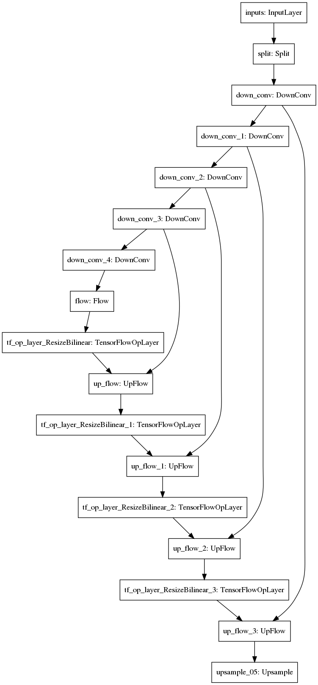

# QPWCNet

This repo contains experimental code for running optical flow and related stuff in Tensorflow 2.

Some efforts have been made to enable quantization through [tensorflow model optimization](https://github.com/tensorflow/model-optimization)
and deploy through [TFLite](https://www.tensorflow.org/lite), though it is still an ongoing development and does not quite work yet.

## Network architecture

TODO(ycho): Update with most up to date arch

## Sample output

Here's a sample output from a trained model on an excerpt from the [Sintel](http://sintel.is.tue.mpg.de/) dataset.

Previous Frame:

Next Frame:

Ground Truth Flow visualization:

Predicted Flow visualization:

## References

Throughout the development of this project I have been inspired by the works from the following repositories:

* [PWCNet-tf2](https://github.com/hellochick/PWCNet-tf2.git)
* [tfoptflow](https://github.com/philferriere/tfoptflow.git)
